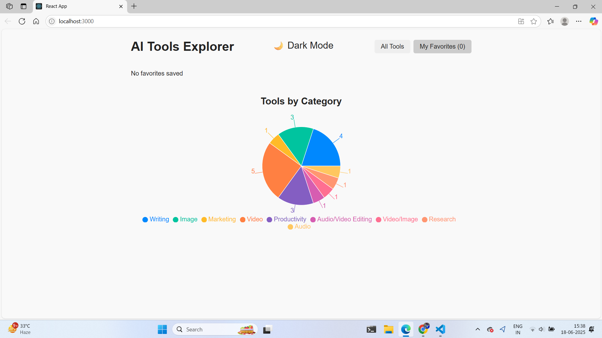
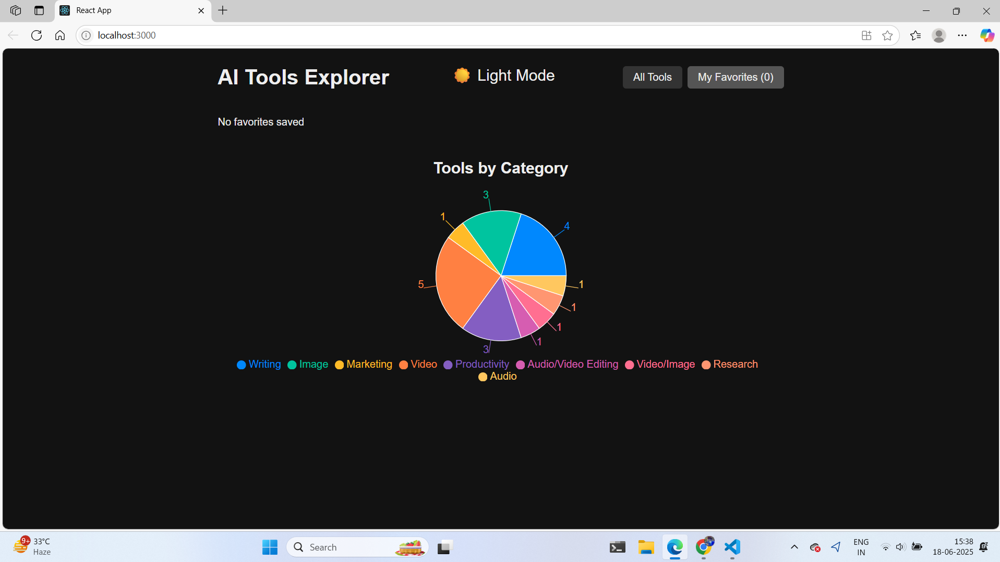

# Smart AI Simulator 🪄

[](https://reactjs.org/)
[](https://axios-http.com/)
[](https://developer.mozilla.org/en-US/docs/Web/JavaScript)
[](https://nodejs.org/)

### 💻 App Interface Preview  
> ☀ Light Theme

> 🌙 Dark Theme


## 🚀 Features

- 🔍 **Search Tools by Name**  
  Quickly find tools by typing keywords into the search bar.

- 🗂 **Filter by Category**  
  Browse AI tools based on predefined categories such as Writing, Image, Marketing, and more.

- ❤️ **Add/Remove Favorites**  
  Easily mark tools as favorites using the heart icon and manage them in your personalized favorites list.

- 🎉 **Confetti Animation on Favorite Add**  
  Celebrate your favorite tool additions with a fun confetti animation for enhanced user experience.

- 🌐 **Live Tool Preview**  
  Click on tool cards to visit and explore their official websites directly.

- 📊 **Category Distribution Pie Chart**  
  Visualize how tools are distributed across different categories using an interactive and responsive pie chart.

- 🌙/☀ **Dark and Light Mode Toggle**  
  Seamlessly switch between dark and light themes to match your preference.

- ⏳ **Loading Spinners**  
  Improve user experience with smooth loading animations during data fetching and view transitions.

- 🧩 **Clean Component-Based Architecture**  
  Well-structured and maintainable code using reusable components like `ToolCard`, `Favorites`, and `ToolList`.


## 🚀 How to Run the Project

### 📦 Prerequisites

Ensure you have the following installed on your machine:

- [Node.js](https://nodejs.org/) (v20 or higher)
- [npm](https://www.npmjs.com/) (comes bundled with Node.js)

---

### 🛠 Setup Instructions

1. **Clone the Repository**

    ```bash
   git clone https://github.com/your-username/your-repo-name.git
   cd your-repo-name

2. **Install Dependencies**

     ```bash
    npm install

3. **Start the React Development Server**
     ```bash
    npm start
4. **🔧 Backend Setup**

    #### 1. Install Dependencies
    ```bash
    npm start
5. **Start the Server**
     ```bash
    npm start

## 📡 API Endpoints

| Method | Endpoint         | Description               |
|--------|------------------|---------------------------|
| GET    | /tools         | Fetch all available tools |
| GET    | /favorites     | Fetch favorite tools      |
| POST   | /favorites/:id | Add a tool to favorites   |
| DELETE | /favorites/:id | Remove a tool from favorites |

## 📄 License

This project is for educational and demonstration purposes.

### Made with ❤ to simplify your AI tool discovery.
